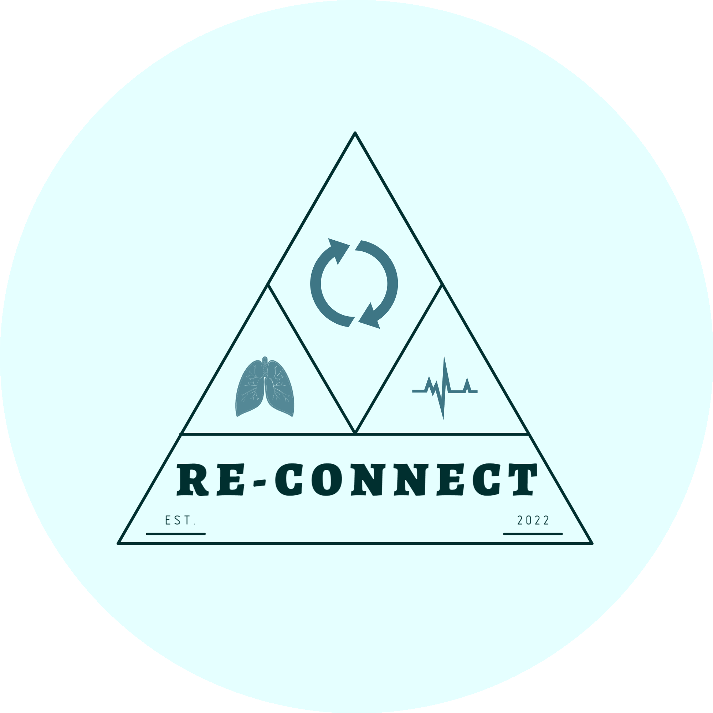

<p align="center">
  <a href="https://reconnectv2.com">
    
  </a>

<br>
<a href="https://github.com/LaoWater/reconnectv2"></a>
<br>
<a href=""></a>
&nbsp;
<a href="https://twitter.com/Re-Connect"></a>
</p>

---

### <u>Project Overview</u>

**Re-Connect** is a **full-stack web application** built with a powerful combination of modern technologies:

- **React**: Provides a fast, responsive, and interactive front-end experience.
- **Python ML Scripts**: Powers intelligent and data-driven backend features.
- **Django**: Robust backend framework to ensure scalability and reliability.
- **JavaScript, CSS, and Tailwind**: Delivers a polished, smooth, and consistent user interface.

---

## Table of Contents

- [Project Overview](#project-overview)
- [Key Features](#key-features)
- [Main Components](#main-components)
  - [I. Online Course Landing Page](#i-online-course-landing-page)
  - [II. Project YLF](#ii-project-ylf)
  - [III. Food Prophet](#iii-food-prophet)
  - [IV. Bibliography](#iv-bibliography)
- [Installation Requirements](#installation-requirements)
- [Environment Requirements](#environment-requirements)
- [Deployment Requirements](#deployment-requirements)
- [Contributions](#contributions)

---

### Key Features
1. **Cost-Effective Hosting**  
   - Designed to help start-ups **host a full web application** with **minimal cost** while maintaining great performance.

2. **Performance-Oriented Architecture**  
   - Combines **SQLite database exchange and syncing** with **Google and environment secrets** for secure data handling.  
   - Optimized for **small-scale production apps**.

3. **Future-Ready Scalability**  
   - Built to **prepare for growth**, ensuring seamless scaling as demand for users and computational resources increases.

4. **Responsive Design**  
   - A **friendly UI** that provides a smooth experience on both desktop and mobile devices.

---

### Re-Connect demonstrates how start-ups can:
- Build a **production-ready application** with low upfront hosting costs.
- Create a secure, reliable system for **database storage and exchange**.
- Transition easily into larger-scale deployments as the need arises.

---

### Visit the Website
[](https://reconnectv2.com)

---

# Main Components


## I. Online Course Landing Page
### The Secrets Of the Alchemy
RO/EN Versions of Online Course Landing page.
Contains combinations of self-generated CSS & JS animations - together with leveraging popular modern libraries - All customized towards Website's Theme.  


## II. Project YLF

Starting point: **Stand-Alone Python trained Large Language Model** [Project YLF](https://github.com/LaoWater/LLM-Create-Process-Train).  

### Explore the full project on
[](https://github.com/LaoWater/LLM-Create-Process-Train)

This app has been **integrated** into the Web App's framework to align with **business needs and context**.

---

### Key Features
1. **LLM Integration**  
   - **Dataset**: Trained on the company's processed dataset.  
   - **Multi-Agent Orchestration Pipeline**: Designed for **rating** and **processing** model responses.
   
2. **Architecture**  
   - **Trained Model**:
     - Receives a prompt and generates an answer.
   - **First-Layer LLM**:
     - Rates the model's answers based on:
       - **Safety**
       - **Context Awareness**
       - **Helping Sentiment**
     - If scoring is below the threshold, it calls the YLF model again, repeating the process until the **threshold is met** or the **attempt limit is reached**.
   - **Second-Layer LLM**:
     - Performs a **final review** and applies **Markdown formatting** to the response.

3. **User-Friendly Design**  
   - A **smooth and responsive UI** for both PC and mobile platforms.

4. **RLHF (Reinforcement Learning with Human Feedback) Integration**  
   - **Feedback Workflow**:
     - Each response can be flagged as **inappropriate** or **unsatisfactory**.
     - Users have the option to provide **complex feedback** via a multi-Dimensions workflow. This feedback is collected and used for RLHF in future model iterations.
   - **YLF Feedback Modal**:
     - A **medium-complex LLM rating form** built with:
       - Multiple **rating dimensions**
       - **Justifications** for scores
       - **Expected responses**

---


## III. Food Prophet
### Stand-Alone React Application

This project is a **Stand-Alone React application** built and deployed within the **Django framework**.

### Repository Link
[](https://github.com/LaoWater/LLM-Create-Process-Train)

---

ML Model developed on Dataset analysis & probabilistic distribution towards accurately Simulating an Archtype(person specific body&lifestyle) Digestion.
React graph continous representation & Responsiveness, allowing async manipulation of Time Dimensions or Custom Meals.
Also offers possibility to Simulate an Empty Archtype and Manually simulate.
Built upon syncronized multiple Web Workers.

IV. Bibliography


**Install requirements**
python 
```
pip install -r requirements.txt
```

**Environment Requirements**
*Variables:*
Open AI Key - OPENAI_API_KEY
Secret key used for fetching database from cloud - SECRET_KEY_DB_EXPORT
For Django Email-Exchange User-submitted form - EMAIL_HOST_USER & EMAIL_HOST_PASSWORD

**If planning on local development env, you're all set up!**


**Deployment Requirements**
###Current Architecture deploys the app on Google Cloud AppEngine, Firebase for storing user models data, Internal Pipeline for sync-inc Databases.
##This allows a safe & smooth UX availability for low to medium scaling.
Once the App scales, consider changing database to a Server-Side one.

app.yaml - Gcloud deployment file. Load needed environment variables here or set up using Google Secrets.
entrypoint Scripts - This script will run as soon as app is deployed. In the current framework of continous dbsql lite deployment and sync,
we are using "./startup.sh" to sync the databases & start web app using Gunicorn.


**We're all set up**
Checkout before merge


***Contributions are welcomed but noted that contributions related to YLF and Food Prophet should be done in their stand-alone repos***